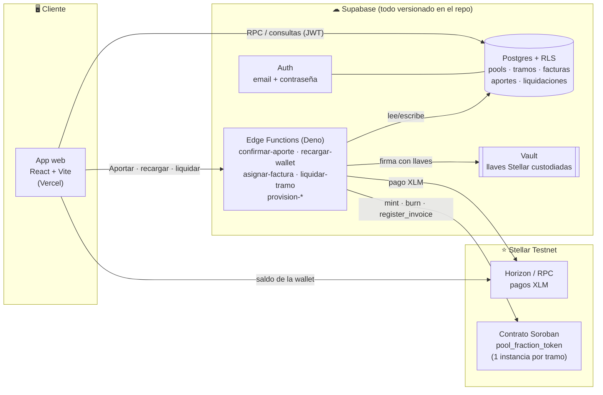
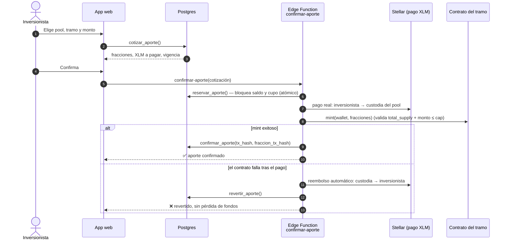

<div align="center">


# Paul

**Invierte desde montos pequeños en pools de facturas de PYMEs peruanas — con fracciones tokenizadas y verificables en Stellar.**

[](#-por-qué-este-track)
[](#-evidencia-on-chain)
[](#-integración-con-stellar)
[](LICENSE)

**Hackathon Stellar Odyssey Perú 2026**

[🚀 Abrir la app](https://paul-neon.vercel.app/acceso) ·
[⛓ Evidencia on-chain](#-evidencia-on-chain) ·
[🔑 Cuentas de demostración](#-prueba-la-app-cuentas-de-demostración) ·
[🧱 Arquitectura](#-arquitectura)

</div>

---

## 🎬 Videos

<table>
  <tr>
    <th align="center">🎤 Video pitch (≤ 3 min)</th>
    <th align="center">🎥 Video demo (producto funcionando)</th>
  </tr>
  <tr>
    <td align="center">El problema, la integración con Stellar y la demo, en 3 minutos.</td>
    <td align="center">Recorrido completo del producto en vivo, de punta a punta.</td>
  </tr>
  <tr>
    <td align="center">
      <a href="https://youtu.be/AWmY0XNfu6c">
        
      </a>
      <br />
      <a href="https://youtu.be/AWmY0XNfu6c"><strong>▶ Ver el video pitch en YouTube</strong></a>
    </td>
    <td align="center"><a href="PEGAR_URL_CANVA_DEMO"><strong>▶ Ver el video demo</strong></a></td>
  </tr>
</table>

<!--
  CÓMO EMBEBER EL VIDEO DEMO (cuando esté en YouTube)
  --------------------------------
  GitHub NO permite <iframe> ni reproductores incrustados en un README. Lo que sí funciona es una
  imagen (miniatura) que enlaza al video, como ya está hecho con el video pitch. Para el video demo,
  reemplaza la celda <td> de PEGAR_URL_CANVA_DEMO por este bloque (cambia VIDEO_ID por el código
  que aparece en la URL del video, por ejemplo youtu.be/VIDEO_ID):

  <td align="center">
    <a href="https://youtu.be/VIDEO_ID">
      
    </a>
    <br />
    <a href="https://youtu.be/VIDEO_ID"><strong>▶ Ver el video demo en YouTube</strong></a>
  </td>

  Alternativa sin YouTube: editar este README desde la web de GitHub y arrastrar el archivo .mp4
  (máx. 100 MB) al editor; GitHub genera una URL "user-attachments" que, pegada sola en una línea,
  se muestra como reproductor incrustado.
-->

---

## 🔑 Prueba la app (cuentas de demostración)

La app está desplegada en **<https://paul-neon.vercel.app/acceso>**. Entra con cualquiera de estas
cuentas — no necesitas registrarte ni instalar una wallet. La contraseña de todas es
`DemoStellar2026!` (son datos de prueba, no secretos).

| Rol | Email | Contraseña | Qué puedes hacer |
|---|---|---|---|
| 💼 Inversionista | `inversionista.demo1@paul.test` | `DemoStellar2026!` | Ya tiene saldo y **una posición confirmada** para ver "Mis posiciones" sin esperar |
| 💼 Inversionista | `inversionista.demo2@paul.test` | `DemoStellar2026!` | Saldo de demostración; lista para aportar |
| 💼 Inversionista | `inversionista.demo3@paul.test` | `DemoStellar2026!` | Saldo de demostración; lista para aportar |
| 🏦 Operador de banco | `operador.demo@paul.test` | `DemoStellar2026!` | Marcar facturas como cobradas y **liquidar tramos** |

Las 3 cuentas de inversionista tienen una **wallet real de Stellar testnet**, fondeada (no una
dirección inventada), creada por el mismo flujo de aprovisionamiento que usa el registro real.
También puedes crear tu propia cuenta desde la pantalla de acceso.

> 💡 **Ruta sugerida de 2 minutos:** entra como `inversionista.demo2` → recarga saldo → abre el pool
> *Manufactura Sur* → aporta al tramo senior → mira tu fracción en el explorador de Stellar. Luego
> entra como `operador.demo` y liquida un tramo.

---

## 🧩 El problema

Una PYME que le vende a una empresa grande entrega la mercadería hoy, pero suele cobrar a **60 o 90
días**. Mientras tanto tiene planillas, proveedores y alquiler que pagar: necesita liquidez *ahora*.
Ese hueco se financia con *factoring* (la PYME cede su factura a cambio de cobrar antes) y con
*confirming* (la empresa pagadora ofrece a sus proveedores la opción de cobrar antes). En el Perú
ya existen plataformas digitales de factoring fraccionado, pero dejan tres vacíos:

- **El riesgo queda concentrado.** El inversionista elige *una* factura de una lista y pone todo su
  dinero en un solo deudor. Si esa factura falla, pierde una parte grande de lo que aportó.
- **La confianza se resuelve con marcas grandes.** Trabajar solo con facturas de empresas
  reconocidas es la forma más simple de generar confianza, pero deja fuera a las PYMEs pequeñas,
  que son justamente las que más necesitan liquidez.
- **La verificación es opaca.** El inversionista confía en que la plataforma lleva bien las
  cuentas, sin poder comprobar por sí mismo qué posee ni si el cupo del activo se respetó.

**La pregunta que nos hicimos:** ¿y si cualquier persona pudiera financiar facturas *diversificadas*,
con el riesgo estructurado en niveles y con una prueba pública e independiente de qué posee?

---

## 💡 La solución

**Paul** es una plataforma de **inversión fraccionada en pools de facturas de confirming**, donde
cada participación queda representada como un token verificable en la red **Stellar**.

```text
   PYMEs / proveedores                         Inversionistas
   (facturas confirmadas por                   (aportan desde una unidad mínima,
    una empresa pagadora grande)                p. ej. S/ 100)
            │                                          │
            ▼                                          ▼
   ┌────────────────────────── POOL ──────────────────────────┐
   │  varias facturas de varias PYMEs (riesgo diversificado)  │
   │                                                          │
   │   TRAMO SENIOR  → prioridad de cobro, menor riesgo       │
   │   TRAMO JUNIOR  → colchón que absorbe primero, mayor     │
   │                    exposición                            │
   └──────────────────────────┬───────────────────────────────┘
                              ▼
        Cada tramo = 1 contrato Soroban en Stellar testnet
        1 fracción = 1 unidad mínima del pool (token SEP-41)
```

Cuatro ideas centrales:

1. **El inversionista no compra una factura: aporta a un pool.** El pool financia muchas facturas a la
   vez, así que el riesgo de una PYME se diluye entre todas las demás.
2. **Tramos senior / junior.** El tramo junior es un colchón de pérdida que protege primero al senior —
   el mismo mecanismo que usan protocolos reales de activos del mundo real (RWA) como Centrifuge.
3. **Confirming como aval de origen.** La empresa pagadora grande es quien incorpora a sus proveedores
   al esquema, y con ello avala indirectamente a las PYMEs pequeñas.
4. **El contrato manda.** Cada fracción existe on-chain; la base de datos nunca "inventa" una posición
   que la blockchain no respalde.

### ¿Qué nos diferencia?

| Dimensión | Factoring fraccionado tradicional | **Paul** |
|---|---|---|
| Unidad de inversión | Una factura elegida a mano | Un **pool diversificado** de varias facturas |
| Gestión del riesgo | Implícita (marca del deudor) | **Explícita**: tramos senior/junior visibles |
| Quién puede entrar | Facturas de empresas grandes | PYMEs incluidas, avaladas vía confirming |
| Verificación de la posición | Confiar en la plataforma | **Cualquiera** la verifica en Stellar sin pasar por Paul |
| Registro del activo | Interno de la plataforma | **Contrato Soroban** por tramo con cupo aplicado on-chain |

> Comparación basada en nuestra investigación del mercado peruano (septiembre 2026); productos,
> montos y tasas de terceros pueden cambiar.

---

## 🎯 ¿Por qué este track?

**Track: Real-World Assets & Compliance** (*Real-World Assets & Compliant Rails*).

Tokenizamos un **activo del mundo real — la factura comercial — con controles de cumplimiento
integrados desde el diseño**, no añadidos después:

| Control | Cómo lo aplicamos |
|---|---|
| **Privacidad del activo subyacente** | On-chain solo se guarda la **huella SHA-256** de cada factura, *nunca sus datos*. El inversionista ve las facturas en versión **anonimizada** (sin proveedor ni deudor). |
| **Roles y separación de funciones** | Rol fijo e **inmutable** (inversionista / operador de banco). Solo el operador registra facturas y liquida; el contrato exige `admin.require_auth()`. |
| **Cupo y unidad mínima aplicados por el contrato** | El `Cap` del tramo solo sube al registrar una factura y **nunca se excede**: la garantía vive en la cadena, no solo en Postgres. |
| **Custodia** | Llaves privadas solo en **Supabase Vault**, jamás legibles desde la API pública. Una cuenta de custodia Stellar dedicada por pool. |
| **Trazabilidad** | Cada aporte, mint, pago y quema deja un hash de transacción verificable públicamente. |
| **Honestidad regulatoria** | Ver [Límites y alcance](#-límites-y-alcance-honestos): en producción el token debería anclarse al registro legal de CAVALI. |

---

## 🚀 Las 10 cosas más importantes que puedes hacer en Paul

Cada punto enlaza con la especificación (`specs/`) que lo respalda. Las especificaciones siguen
[Spec Kit](https://github.com/github/spec-kit): historias de usuario priorizadas, escenarios de
aceptación, modelo de datos, contratos de API y guía de validación (`quickstart.md`).

| # | Lo que puedes hacer | Por qué importa | Especificación |
|---|---|---|---|
| **1** | **Registrarte y recibir una wallet real de Stellar automáticamente**, sin frases semilla ni extensiones. | Elimina la mayor barrera de entrada a blockchain. La llave queda custodiada en Vault. | [Auth y perfil](specs/20260919-131233-auth-perfil-usuario/spec.md) |
| **2** | **Recargar saldo de demostración y recibir XLM real** de testnet en tu wallet (con tope diario e idempotencia). | El saldo contable y el pago on-chain van juntos; un reintento nunca duplica el pago. | [Pools y aporte](specs/20260920-113925-inversion-pools-aporte/spec.md) — Hist. 3 |
| **3** | **Explorar y comparar 6 pools** filtrando por moneda, plazo, perfil de riesgo, sector y avance de fondeo. | Decidir con información, no a ciegas. Hay pools en soles y en dólares, de 30 a 90 días. | [Pools y aporte](specs/20260920-113925-inversion-pools-aporte/spec.md) — Hist. 1 |
| **4** | **Ver el detalle de un pool antes de aportar**: tramo senior vs. junior, colchón de pérdida y las **facturas que lo respaldan, anonimizadas** (monto, plazo, sector, estado de cobro). | Transparencia real sin exponer a proveedores ni deudores. | [Pools y aporte](specs/20260920-113925-inversion-pools-aporte/spec.md) — Hist. 2 · [Originación](specs/20260920-174938-originacion-facturas-pool/spec.md) — Hist. 4 y 5 |
| **5** | **Aportar desde una unidad mínima (S/ 100 en Manufactura Sur)**: cotizas, confirmas, se paga en XLM real y **recibes fracciones tokenizadas** en tu wallet. | Es el momento en que un activo del mundo real se vuelve un token que *tú* posees. | [Pools y aporte](specs/20260920-113925-inversion-pools-aporte/spec.md) — Hist. 4 · [Originación](specs/20260920-174938-originacion-facturas-pool/spec.md) — Hist. 3 |
| **6** | **Aportar en paralelo con otras personas sin que nunca se sobrevenda un tramo.** El cupo se reserva de forma atómica y además lo impone el contrato. | Con muchos usuarios simultáneos, el activo no se "infla". Reproducido con ráfagas de aportes concurrentes. | [Pools y aporte](specs/20260920-113925-inversion-pools-aporte/quickstart.md) — §5 · [Originación](specs/20260920-174938-originacion-facturas-pool/research.md) |
| **7** | **Confiar en que un aporte nunca queda a medias**: si tras tu pago el contrato falla, el sistema **te reembolsa automáticamente** antes de revertir. | Consistencia entre dinero, base de datos y blockchain, incluso cuando algo falla. | [Originación](specs/20260920-174938-originacion-facturas-pool/spec.md) — Hist. 3 |
| **8** | **(Operador) Registrar facturas, validarlas y asignarlas a un tramo**: el sistema calcula el fraccionamiento y registra la **huella de la factura** en el contrato. *(Disponible vía API/Edge Function; sin pantalla en esta versión.)* | El activo real entra al sistema de forma controlada y auditable, sin publicar datos sensibles. | [Originación](specs/20260920-174938-originacion-facturas-pool/spec.md) — Hist. 1 y 2 |
| **9** | **(Operador) Marcar facturas como cobradas y liquidar un tramo completo desde la app**: cada inversionista recibe su **pago real en XLM** y sus fracciones se **queman on-chain** firmando con su propia llave. | Cierra el ciclo *aportar → poseer → cobrar*. Rechaza la liquidación si falta cobrar una factura, y si un pago falla compensa solo a esa persona. | [Liquidación de tramo](specs/20260925-002004-liquidacion-tramo/spec.md) |
| **10** | **Verificar todo tú mismo, sin confiar en Paul**: tu saldo de fracciones, el `total_supply` y el historial completo están en Stellar Expert y en la CLI de Stellar. | Es la prueba de que no es una simulación: cada paso tiene un hash comprobable. | [Evidencia on-chain](#-evidencia-on-chain) |

Además, en **"Mis posiciones"** el inversionista consulta lo que ya aportó, y en el **perfil** ve su
wallet y su saldo real en Horizon.

### 🔜 Lo que sigue: cobro real, reparto de retornos y pérdidas entre tramos

La siguiente especificación ya está escrita y planificada, pero **todavía no está implementada**. Vive
en su propia rama:
[`20260923-210731-cobro-reparto-retornos`](https://github.com/nicolasIsmael/paul/tree/20260923-210731-cobro-reparto-retornos/specs/20260923-210731-cobro-reparto-retornos)
(`spec.md`, `plan.md`, `research.md`, `data-model.md`, `tasks.md`, contratos de API y `quickstart.md`).

| Capacidad especificada (pendiente) | Qué añade |
|---|---|
| **Cobro de una factura como pago real del deudor** | El operador simula que el deudor pagó: transferencia real en testnet desde una cuenta "deudor" hacia la custodia del pool. Solo entonces la factura pasa a *cobrada*. También puede marcarla *en mora*. |
| **Reparto con cascada de pérdidas (waterfall)** | Las pérdidas por mora se restan **primero del capital del tramo junior**; el senior solo se ve afectado si la pérdida supera todo lo aportado por el junior. Cada inversionista recibe su reparto en una sola transacción. |
| **Reparto forzado por el operador** | Cierra un tramo antes de tiempo aplicando el mismo criterio de mora a las facturas pendientes. |
| **Reloj simulado por pool** | Adelanta la fecha de un pool para mostrar el ciclo completo en una demo en vivo sin esperar vencimientos reales. |

> La versión implementada hoy liquida el tramo completo cuando el 100 % de sus facturas está cobrada
> (camino feliz). La cascada de pérdidas junior → senior es el siguiente paso.

---

## 🧱 Arquitectura

Paul tiene tres capas que se coordinan para que **dinero, datos y blockchain no se desalineen**.



### El flujo estrella: un aporte



### Decisiones de diseño que importan

| Decisión | Por qué |
|---|---|
| **El contrato manda** | Un aporte solo se confirma en Postgres *después* de que el contrato emitió las fracciones. El pago de liquidación se calcula sobre el `balance()` **on-chain**, nunca sobre un número que solo exista en la base de datos. |
| **Cupo comprometido al reservar, no al confirmar** | Un `UPDATE` condicional de una sola sentencia impide que aportes concurrentes sobrevendan un tramo. |
| **Compensación en lugar de "todo o nada"** | Si falla el mint, se reembolsa. Si falla la liquidación de un inversionista, se compensa solo a esa persona y el resto del tramo se sigue procesando. |
| **Serialización de firma por cuenta** | Stellar admite una transacción "en vuelo" por número de secuencia. Un *lock* respaldado en Postgres serializa las firmas de cuentas compartidas entre Edge Functions concurrentes. |
| **Un solo contrato, una instancia por tramo** | Un único WASM (~7 KB) instanciado 12 veces (6 pools × senior/junior). Añadir un pool no requiere código nuevo. |
| **Infraestructura como código** | Ningún objeto de base de datos se crea desde el Dashboard de Supabase: todo son migraciones versionadas (Principio VII de la [constitución](.specify/memory/constitution.md)). |

### Estructura del repositorio

```text
paul/
├── apps/web/                  # Frontend React 19 + Vite + TypeScript (desplegado en Vercel)
│   └── src/pages/             #   Acceso · Dashboard · Pools · Detalle · Posiciones · Liquidaciones · Perfil
├── contracts/
│   ├── soroban-pool/          # Contrato Soroban (Rust): pool_fraction_token, interfaz SEP-41 completa
│   ├── scripts/deploy.sh      # Sube el WASM, instancia un contrato por tramo, publica la configuración
│   └── deployments/testnet.json   # IDs de contrato + wasm_hash desplegados (sin secretos)
├── supabase/
│   ├── migrations/            # 22 migraciones SQL (0001 … 0022): esquema, RLS, RPC, triggers
│   ├── functions/             # 7 Edge Functions (Deno) + _shared/ (SDK Stellar, locks, pagos, Soroban)
│   └── seed/                  # Datos de demostración: cuentas, pools, tramos, facturas, posiciones
├── specs/                     # Especificaciones por feature (spec · plan · research · data-model · tasks)
├── docs/                      # Diagramas de arquitectura y de flujo de punta a punta (draw.io / pptx)
└── .specify/memory/           # Constitución del proyecto (principios que rigen las decisiones)
```

---

## ⭐ Integración con Stellar

| Capacidad de Stellar | Cómo la usamos |
|---|---|
| **Soroban (smart contracts en Rust)** | Contrato `pool_fraction_token` con `soroban-sdk 28`: `initialize`, `register_invoice`, `mint`, `burn`, `transfer`, `approve`, `allowance`, `balance`, `cap`, `total_supply`. Errores tipados (`CapExceeded`, `InvoiceAlreadyRegistered`, …). **9 pruebas unitarias.** |
| **Estándar de token SEP-41** | Las fracciones cumplen la interfaz completa de token de Soroban (`decimals = 0`; 1 fracción = 1 unidad mínima del pool), por lo que cualquier wallet o explorador compatible las entiende. |
| **Pagos nativos en XLM (Horizon)** | Recargas, aportes, reembolsos y pagos de liquidación son **transacciones reales de testnet**, no saldos simulados. |
| **Cuentas y fondeo (Friendbot)** | Cada inversionista y cada pool reciben una cuenta Stellar propia, generada y fondeada al vuelo. |
| **Autorización de Soroban** | `register_invoice` y `mint` exigen la firma del admin; la quema de una liquidación la firma **el propio inversionista** con su llave custodiada. |
| **Simulación, reintentos y reconciliación** | Invocaciones con reintentos y lectura de solo consulta (`balance`, `total_supply`, `cap`) para reconciliar el estado real de la cadena. |
| **`@stellar/stellar-sdk` v17** | Necesaria para parsear la meta de transacciones del protocolo 28 (ver [hallazgos](#-hallazgos-reales-que-corregimos)). |

---

## ⛓ Evidencia on-chain

Todo ocurre en **Stellar Testnet**. Cada enlace se puede abrir sin cuenta ni permisos.

### 📌 Contrato principal: tramo senior de "Manufactura Sur"

| | |
|---|---|
| **Contrato (`pool_fraction_token`)** | [`CCGH3FI2775BI2KPA5HDTTRBSTSACE2X2H4ZJJ56NWGUBWQ2NWFGQBWO`](https://stellar.expert/explorer/testnet/contract/CCGH3FI2775BI2KPA5HDTTRBSTSACE2X2H4ZJJ56NWGUBWQ2NWFGQBWO) |
| **Qué muestra** | Su historial real completo: `register_invoice` → `mint` → `burn` de la liquidación |
| **`wasm_hash` (los 12 contratos)** | `25af11fb4fc9febd1cf91991a8127e8f9d0b1d3b3467a6f39c8b69304b33f0ca` |

### 🧾 Transacciones reales del ciclo de vida

| Paso | Qué ocurrió | Transacción |
|---|---|---|
| **Registro de factura** | `register_invoice` on-chain: el cupo del tramo sube a `312` fracciones | [`f4f27687…be80`](https://stellar.expert/explorer/testnet/tx/f4f276878251d6bd18745263af2d99126d35c852649f19639ceceaa4e82fbe80) |
| **Aporte — pago** | Pago real en XLM del inversionista a la custodia del pool | [`bf944881…fc38`](https://stellar.expert/explorer/testnet/tx/bf94488143dadffaf197d0930da0ba6f965821820336e400e2cec4bf8845fc38) |
| **Aporte — emisión** | `mint` de la fracción a la wallet del inversionista | [`126d7252…c8bb`](https://stellar.expert/explorer/testnet/tx/126d725275572e8f31716c7a1042e3be82a454f709aa1720bcd43814bfcbc8bb) |
| **Liquidación — pago** | Pago real de capital + rendimiento ilustrativo (S/ 101.60 convertido a XLM) | [`98969b67…2173`](https://stellar.expert/explorer/testnet/tx/98969b6752a3cea4a59349b451a6604a18c949a301204fc07dbb761980522173) |
| **Liquidación — quema** | `burn` de la fracción, firmado con la llave del inversionista | [`7ac65dd0…a74a`](https://stellar.expert/explorer/testnet/tx/7ac65dd0d9253c9ea4c6554891110b34d0a3a313685e3eb96eb691f2f186a74a) |
| **Reembolso manual** | Reconciliación de un caso real de concurrencia (ver hallazgos) | [`bf270162…a4a7`](https://stellar.expert/explorer/testnet/tx/bf2701624b379eb992a48aeb6e410a73a9a5c39c8437baacaef42e5325acb4a7) |
| **Subida del WASM** | Publicación del código del contrato en testnet | [`e7bfd858…d71d`](https://stellar.expert/explorer/testnet/tx/e7bfd858245748cbd5e64b2d69f0eb61e890a6afd6f04d460432c9c243bdd71d) |

### 🗂 Los 12 contratos desplegados

Un contrato por tramo, con la lista versionada en
[`contracts/deployments/testnet.json`](contracts/deployments/testnet.json).

| Pool | Senior | Junior |
|---|---|---|
| POOL-PEN-001 · Retail Norte | [`CCAQJAZF…7RRE`](https://stellar.expert/explorer/testnet/contract/CCAQJAZFFITJ6DJY7T6OG343OAURAWGLUQUF3ONKNBN55FMYP3EA7RRE) | [`CAGPMH4C…5NZEN`](https://stellar.expert/explorer/testnet/contract/CAGPMH4CXI5L65VQXKPU3YQQLDEDFHOHX34CZZW2D6OS7HZ77WG5NZEN) |
| POOL-PEN-002 · Manufactura Sur | [`CCGH3FI2…WBWO`](https://stellar.expert/explorer/testnet/contract/CCGH3FI2775BI2KPA5HDTTRBSTSACE2X2H4ZJJ56NWGUBWQ2NWFGQBWO) | [`CCHCJNBY…MC4J`](https://stellar.expert/explorer/testnet/contract/CCHCJNBYUMSRZYIS3HFVU5WPK6QF3GLYCJ2PBJVDTYPIAZZAVSIZMC4J) |
| POOL-PEN-003 · Servicios Lima | [`CCQGYGRX…YPZPR`](https://stellar.expert/explorer/testnet/contract/CCQGYGRXNGEBOMZFJJL2KSATW6YDDUG3JHU3WAWFD7VYSLAEVVUYPZPR) | [`CCKMMHEM…4QP6`](https://stellar.expert/explorer/testnet/contract/CCKMMHEMDHZ76CKD66LJTKA7TIBFGNQU4FMAUDOFJKRYR5IUNBQJ4QP6) |
| POOL-PEN-004 · Construcción Centro | [`CDVYSMY7…2454`](https://stellar.expert/explorer/testnet/contract/CDVYSMY73FLV4F7VDUJNTU7JW42UGJGGQ4M7LXBW2XFPBHFEBV2U2454) | [`CD446D4F…3SDMN`](https://stellar.expert/explorer/testnet/contract/CD446D4FKDCBCZCB6WWL4U6J3XDWNKK5G5UZF5UAABI7LGHL7UQ3SDMN) |
| POOL-PEN-005 · Comercio y Tecnología Mixto | [`CD32SZ36…DLZHJ`](https://stellar.expert/explorer/testnet/contract/CD32SZ36EPS3EJS4QWKOSAVCML7PC56RDI3NQRQNYZQBG7RGMIZDLZHJ) | [`CAUSGVBM…PSZ5`](https://stellar.expert/explorer/testnet/contract/CAUSGVBMYK7XW7ZLNO4EB24RWFSQJL2CGATQNIZIFEQ4BMM6A62APSZ5) |
| POOL-USD-001 · Tecnología Exportadora | [`CBZRTNXM…PGDU`](https://stellar.expert/explorer/testnet/contract/CBZRTNXMHEPBDDORC5MU53B5A34FER4YPXB2ESXXP6D4XBQ74R7BPGDU) | [`CCNJRAVS…MOTCV`](https://stellar.expert/explorer/testnet/contract/CCNJRAVSYTT6VFMS6LOUG4Z6LV2IPKQGRHPN7NT4PH5VMBLS3U6MOTCV) |

### 🔍 Verifícalo de forma independiente (sin pasar por el backend de Paul)

```bash
# Cupo del tramo = 3200 PEN / 100 (unidad mínima) → devuelve 312
stellar contract invoke \
  --id CCGH3FI2775BI2KPA5HDTTRBSTSACE2X2H4ZJJ56NWGUBWQ2NWFGQBWO \
  --source <cualquier-cuenta> --network testnet --send=no -- cap

# Tras la liquidación, la fracción quemada deja el suministro en 0
stellar contract invoke \
  --id CCGH3FI2775BI2KPA5HDTTRBSTSACE2X2H4ZJJ56NWGUBWQ2NWFGQBWO \
  --source <cualquier-cuenta> --network testnet --send=no -- total_supply
```

---

## ▶️ Cómo ejecutarlo

### Opción A — Solo probar (recomendada)

Abre **<https://paul-neon.vercel.app/acceso>** y entra con una [cuenta de demostración](#-prueba-la-app-cuentas-de-demostración).
No hay nada que instalar.

### Opción B — Frontend en local contra el backend ya desplegado

Requisitos: **Node.js 20.19+** (requerido por Vite 7).

```bash
git clone https://github.com/nicolasIsmael/paul.git
cd paul

# 1. Variables de entorno del frontend
cp apps/web/.env.example apps/web/.env
#    Completa VITE_SUPABASE_PUBLISHABLE_KEY con la clave pública (publishable) del proyecto.
#    Nunca pongas SUPABASE_SERVICE_ROLE_KEY en apps/web/.env ni en código cliente.

# 2. Instalar y ejecutar
npm install
npm run dev          # http://127.0.0.1:4173
```

> Sin la clave pública, la pantalla de configuración ofrece una **vista previa local con datos
> ficticios** (solo desarrollo; no sustituye las pruebas contra Supabase).

Otros comandos: `npm run typecheck` · `npm run build` · `npm run preview`.

### Opción C — Backend completo en local (Supabase)

Requisitos: **Docker Desktop**, Supabase CLI (ya es dependencia de desarrollo del repo).

```bash
cp .env.example .env         # completa los valores reales; .env nunca se commitea
npx supabase start
npx supabase db reset        # SOLO local: aplica las 22 migraciones + supabase/seed/*.sql
```

`db reset` recrea las 4 cuentas de demostración, los 6 pools con sus tramos, facturas de ejemplo en
varios estados de cobro y saldos iniciales. Cada feature incluye un `quickstart.md` con la validación
paso a paso:

- [`specs/20260919-131233-auth-perfil-usuario/quickstart.md`](specs/20260919-131233-auth-perfil-usuario/quickstart.md)
- [`specs/20260920-113925-inversion-pools-aporte/quickstart.md`](specs/20260920-113925-inversion-pools-aporte/quickstart.md)
- [`specs/20260920-174938-originacion-facturas-pool/quickstart.md`](specs/20260920-174938-originacion-facturas-pool/quickstart.md)
- [`specs/20260925-002004-liquidacion-tramo/quickstart.md`](specs/20260925-002004-liquidacion-tramo/quickstart.md)

### Opción D — Contrato Soroban

Requisitos: Rust con el target `wasm32v1-none` y [`stellar-cli`](https://developers.stellar.org/docs/tools/cli).

```bash
cd contracts/soroban-pool
cargo test                   # 9 pruebas unitarias
stellar contract build       # genera el WASM optimizado (~7 KB)

# Despliegue: sube el WASM, instancia un contrato por tramo y publica la configuración en Supabase
SUPABASE_URL=... SUPABASE_SERVICE_ROLE_KEY=... ./contracts/scripts/deploy.sh
```

### Despliegue del frontend en Vercel

El proyecto se despliega desde la raíz del repositorio (`vercel.json` configura el build del workspace
y las rutas de React Router).

| Ajuste | Valor |
|---|---|
| Root Directory | `.` (raíz del repositorio) |
| Framework Preset | `Vite` |
| Install Command | `npm ci` |
| Build Command | `npm run build` |
| Output Directory | `apps/web/dist` |
| Variables (Production, Preview, Development) | `VITE_SUPABASE_URL=https://qqpozotcrxfukkwcoget.supabase.co` · `VITE_SUPABASE_PUBLISHABLE_KEY=<clave publishable>` |

Tras crear o cambiar variables hay que lanzar un nuevo *deployment* para que Vite las incorpore.

---

## 🛠 Qué construimos durante la semana

### Commit base declarado

> **Punto de partida: [`45dcc8b`](https://github.com/nicolasIsmael/paul/commit/45dcc8be12149a4cd4c482e65c31c0c6673e98c8)**
> — *Initial commit*, 19 de septiembre de 2026, 10:37 (hora de Perú), el mismo día del kickoff.
> Contiene únicamente el archivo `LICENSE` y un `README.md` de una línea.
> **Todo el código, los contratos, las migraciones, las especificaciones y la interfaz de este
> repositorio se construyeron dentro de la ventana de desarrollo (19 → 25 de septiembre).**

### Línea de tiempo

| Día | Hito |
|---|---|
| **19 sep** | Kickoff. Constitución del proyecto, esquema base de Supabase y **módulo de autenticación y perfil** con wallet Stellar real por inversionista (migraciones `0001`–`0002`). |
| **20 sep** | **Módulo de pools y aporte**: catálogo, detalle, saldo de demostración, cotización y confirmación de aportes (`0003`–`0010`). **Módulo de originación de facturas**: registro/validación/asignación y el **contrato Soroban** desplegado en 12 instancias (`0011`–`0015`). Primer frontend web y despliegue en Vercel. |
| **22 sep** | Correcciones críticas de sincronización on-chain (*lock* de firma por cuenta, `0016`), recargas con pago XLM real (`0017`), guías de integración y **diagramas de arquitectura**. Frontend responsive móvil. |
| **23 sep** | **Checkpoint intermedio**: documentos de arquitectura, diagramas de flujo de punta a punta y spec del siguiente módulo (cobro y reparto). |
| **25 sep** | **Módulo de liquidación de tramo** (pago real + quema de fracciones), su pantalla para el operador, bloqueo de aportes a tramos liquidados y reanudación de liquidaciones (`0018`–`0022`). Validación en vivo y reescritura del README. |

### En números

| | |
|---|---|
| Commits | 31, de 3 autores |
| Módulos de producto especificados e implementados | 4 (+ 1 especificado y pendiente) |
| Migraciones SQL versionadas | 22 |
| Edge Functions | 7 |
| Contrato Soroban | 1 WASM (~7 KB), 9 pruebas unitarias, **12 instancias en testnet** |
| Pantallas web | Acceso · Dashboard · Catálogo · Detalle de pool · Posiciones · Liquidaciones · Perfil |
| Pools de demostración | 6 (5 en soles, 1 en dólares), cada uno con tramo senior y junior |

### 🐛 Hallazgos reales que corregimos

Validamos cada módulo **en vivo contra el proyecto real y Stellar testnet**, no con *mocks*. Eso hizo
aflorar fallos que un entorno simulado no habría mostrado:

1. **`@stellar/stellar-sdk@^13` no puede leer transacciones del protocolo 28** (`Bad union switch: 4`).
   Cada invocación exitosa lanzaba una excepción justo *después* de confirmarse, disparaba reintentos y
   provocó una **emisión duplicada real** de fracciones. Se reconciliaron quemando las fracciones
   fantasma y reembolsando el pago; se corrigió subiendo a `stellar-sdk@^17`.
2. **Colisión de número de secuencia en firmas concurrentes.** Dos aportes simultáneos firmaban `mint`
   con la misma cuenta y chocaban; también los reembolsos de compensación. Un aporte quedó con el pago
   hecho pero sin fracciones ni reembolso. Se corrigió con un *lock* por cuenta firmante respaldado en
   Postgres ([`0016_lock_firma_stellar.sql`](supabase/migrations/0016_lock_firma_stellar.sql)) y se
   verificó repitiendo la misma ráfaga: las 3 reservas válidas mintearon sin choque y las 3 rechazadas
   por cupo fallaron limpiamente sin tocar la red.
3. **La liquidación pagaba soles como si fueran XLM.** Detectado antes de mover dinero real; se corrigió
   reutilizando el tipo de cambio de referencia de las cotizaciones
   ([`0019`](supabase/migrations/0019_liquidacion_tramo_tipo_cambio.sql)).
4. **Se podía aportar a un tramo ya liquidado.** Corregido y verificado en vivo
   ([`0020`](supabase/migrations/0020_bloquear_aportes_tramo_liquidado.sql)).

### 👥 Equipo

| GitHub | Áreas principales según el historial del repositorio |
|---|---|
| [@nicolasIsmaelUTP](https://github.com/nicolasIsmaelUTP) | Backend y modelo de datos, autenticación, pools y aportes, originación de facturas, contrato Soroban |
| [@Daftkillerxd](https://github.com/Daftkillerxd) | Frontend web, despliegue en Vercel, sincronización de recargas y aportes con Stellar |
| [@vlenix2505](https://github.com/vlenix2505) | Corrección on-chain, diagramas de arquitectura, checkpoint y módulo de liquidación de tramo |

### 🧭 Metodología

Trabajamos con **desarrollo guiado por especificaciones** ([Spec Kit](https://github.com/github/spec-kit)):
cada módulo nace como una `spec.md` con historias de usuario priorizadas y criterios de éxito medibles,
sigue con `plan.md`, `research.md`, `data-model.md` y `tasks.md`, y termina con un `quickstart.md`
ejecutado en vivo. Los principios que rigen el proyecto están en la
[constitución](.specify/memory/constitution.md); los dos innegociables son **evidencia on-chain real,
no simulada** (Principio VI) y **toda la infraestructura de Supabase versionada en el repositorio**
(Principio VII).

---

## 🧪 Límites y alcance honestos

Preferimos ser claros sobre qué es y qué no es este prototipo:

- **Es una demostración técnica en Stellar Testnet.** No se opera con fondos reales de terceros, no se
  capta dinero del público ni se ofrecen instrumentos de inversión.
- **El "rendimiento" es solo ilustrativo.** Las cifras de rendimiento que muestra la app son datos de
  ejemplo para ilustrar la mecánica; **no constituyen una promesa de retorno** ni asesoría financiera.
- **El token no reemplaza a CAVALI.** En Perú, una factura negociable solo tiene mérito ejecutivo si
  está anotada en CAVALI (Ley N.º 29623). Paul es una capa técnica programable que corre en paralelo;
  en producción, el token tendría que anclarse al registro legal reconocido.
- **KYC/AML y supervisión SBS/SMV no están implementados.** Son el siguiente paso regulatorio.
- **Las facturas y las empresas son ficticias.** El underwriting real de una PYME requiere evaluación
  crediticia real; aquí se simplifica con datos de demostración.
- **Alcance de esta versión:** la liquidación cubre el camino feliz (todas las facturas cobradas). La
  mora, el pago parcial y la cascada de pérdidas junior → senior están especificados, no implementados.
- **El registro y la asignación de facturas del operador** se usan vía API/Edge Function; la interfaz
  web del operador cubre hoy el cobro de facturas y la liquidación de tramos.

---

## 🗺 Hoja de ruta

1. **Cobro real y reparto con cascada de pérdidas** — especificado en la rama
   [`20260923-210731-cobro-reparto-retornos`](https://github.com/nicolasIsmael/paul/tree/20260923-210731-cobro-reparto-retornos/specs/20260923-210731-cobro-reparto-retornos).
2. **Reloj simulado por pool** para demostrar ciclos completos en vivo.
3. **Pantallas para el operador** (registro y asignación de facturas) y para proveedor/deudor.
4. **Underwriting escalonado y *first-loss* del originador** (skin in the game) como reglas de entrada al pool.
5. **Anclaje del registro al de CAVALI** y controles KYC/AML sobre rieles de *anchor*/*off-ramp*.
6. **Mercado secundario** de fracciones (la interfaz SEP-41 ya permite `transfer`).
7. **App móvil** (el monorepo ya reserva `apps/mobile`).

---

## 🧰 Tecnologías y créditos de terceros

Declaramos todas las dependencias principales; todas tienen licencias permisivas compatibles con MIT.

| Capa | Tecnología |
|---|---|
| Blockchain | [Stellar](https://stellar.org) Testnet, [Soroban](https://soroban.stellar.org) (`soroban-sdk` 28), Horizon, Friendbot, `@stellar/stellar-sdk` 17, `stellar-cli` |
| Contrato | Rust, interfaz SEP-41 |
| Backend | [Supabase](https://supabase.com): Postgres con RLS, Auth, Vault, Edge Functions (Deno), Database Webhooks (`pg_net`) |
| Frontend | React 19, Vite 7, TypeScript 5, React Router 7, Recharts, lucide-react, `@supabase/supabase-js` |
| Despliegue | Vercel |
| Proceso | [Spec Kit](https://github.com/github/spec-kit) |

No partimos de ningún *fork* ni de una base de código preexistente: el repositorio nace vacío en el
[commit base](#commit-base-declarado).

---

## 📚 Documentación del proyecto

| Documento | Contenido |
|---|---|
| [Constitución](.specify/memory/constitution.md) | Principios que rigen las decisiones técnicas y de producto |
| [`specs/`](specs/) | Especificación, plan, investigación, modelo de datos y guía de validación de cada módulo |
| [Guías de integración de frontend](specs/20260920-113925-inversion-pools-aporte/frontend-integration.md) | Cómo consumir cada operación (registro, pools, aportes, códigos de error `PA001`–`PA0xx`) |
| [`docs/arquitectura-paul.drawio`](docs/arquitectura-paul.drawio) | Diagrama de arquitectura (abrir con [draw.io](https://app.diagrams.net)) |
| [`docs/flujo-end-to-end.drawio`](docs/flujo-end-to-end.drawio) | Flujo de punta a punta: registro, facturas, asignación, contrato, aporte |
| [`docs/Paul - Flujo end to end.pptx`](docs/Paul%20-%20Flujo%20end%20to%20end.pptx) | Presentación del flujo completo |

---

## 📄 Licencia

Distribuido bajo la licencia **MIT**. Consulta el archivo [LICENSE](LICENSE).

<div align="center">

Hecho en Perú 🇵🇪 para **Stellar Odyssey Perú 2026**.

</div>
